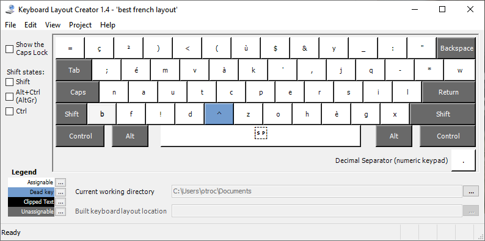

# **NAUTCP** The best french keyboard layout 

## the problem
If you're here you proably heard that qwerty is'nt the bert keyboard. 
In england they have mnhy layout like dvorac, ...
but in french, as far as I Know, We havn't many option for us and we are using the french version of qwerty, azerty.

For solving this issue, I want to create a keyboard layout specialy for the french language

## how I solvit

For this at first we can think that we can use annother repo that create an "ia" (generational) for optimizing the layout and just make a fewx change to adapt for the french.

### the setup

The first think I need was a corpus of french word. For that I use a part from the diabla corpus (https://github.com/rbawden/DiaBLa-dataset/blob/master/DiaBLa-corpus/raw-corpus/diabla.fr2en.orig)

The second think I was needed was a french keyboard layout in the code. For that and now on all the keyboard layout will be like this : a 2d array of a len of 5*13. all the "control key" will not move (tab, caps lock, maj,.. will not move).
So I've done it manually and the result is that:

│ '²'  │ '&' │ 'é' │'"'│"'"│'('│'-'│'è'│'_'│'ç'│  'à'  │')' │ '=' │'backspace'│
│'tab '│ 'a' │ 'z' │'e'│'r'│'t'│'y'│'u'│'i'│'o'│  'p'  │'^' │ '$' │  'enter'  │
│'caps'│ 'q' │ 's' │'d'│'f'│'g'│'h'│'j'│'k'│'l'│  'm'  │'ù' │ '*' │  'enter'  │
│'maj' │ '<' │ 'w' │'x'│'c'│'v'│'b'│'n'│','│';'│  ':'  │'!' │'maj'│   'maj'   │
│'ctrl'│'win'│"alt'│' '│' '│' '│' '│' '│' '│' '│'altgr'│'fn'│'rc' 

The third thing and more tedious task I will do before creating the best layout is to map all the other key.
By that I mean that I nead to say that the A is a combination of the "maj" key and of the "a" key.
At forst glance this seam less tedious than the 2nd task but that forgeting that french is special and have a set of dead key (2 actually,the circumflex (^^) accent and the diaeresis(¨¨)).

This is because of this 3 thing that i decide to create my own "ia" to generate the best keyboard (and because it's fun too :D). The last thing was really decised because that a french touch and I didn't want if I was using another repo to do all this extra work.

### the "ia"

For generating the keyboard I start from the normal azerty keyboard. At each step I create a new layout by modifying the previous one by swaping 2 character. After that, I test the new one on the diabla corpus and if it better than the previous one we save it and if not we go next.
But that one is alwys going for the local minimum and We want the Best French layout not an optimized one. So, to counter this effect, time to time the program will chose to keep the weak one to maybe later will be better. The program is using an temperature variant that decrease over time and decrease also the probability to keep the weaker one.

If you are in the code you can see there is an other generative ia to create the best layout. the problem with this one it's not stable at all and it's hard for the ia to converge to a keyboard.

## The result

So for having the best result keyboard, I decided to have smaller gen (they was 20_000 gen before) and after one finish it, I save it and create an other one from scratch. And I reapeted this process over a night and in the morning, when i wake up I discover the bes keyboard layout.

So the result is the layout NAUTCP (I use the key from the home key to be simpler)

the layout have a distance over a sample of 30k character of 14611 (the 1 distance it's a movement of 1 horizontally)
to compare the azerty layout have a distance of 26271, that's praticly the double!

## instalation

If you want to test this keyboard layout you can use this [microsft tool](https://www.microsoft.com/en-us/download/details.aspx?id=102134)

in the software you use the load from the source file, use the one from the repo. then you build it and run the file for youre cpu architecture.
after that in the setting you can find the keyboard layout and use it.

If you want a more in depth tutorial [go here](https://www.addictivetips.com/windows-tips/install-custom-keyboard-windows-10/)

For the usage I will recomend you to change the key of your keyboard, maybe use 2 keyboard because an azerty is alway usefull for game and shortcut, ...

after that your keyboard will look something like this:

